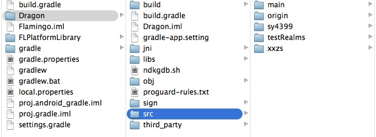

##Android学习笔记之了解Java部分代码结构，知道各自职能
####From JiaYing.Cheng

---
---

上图：

图1


图2


图1和图2是项目里边`Android部分`的代码，通过Gradle实现自动化构建工程。

图1中Dragon/src目录下的源代码是与渠道分发的相关代码。由于每个渠道的独特性，所以每个渠道的SDK实现不可能完全一致，APP在不同的渠道上发布的时候，相关的实现也会有所不同。一般情况下，这里有多少个类似`sy4399`这样的文件夹，就表示有多少个渠道。实现的配置可以在`build.gradle`里面可以看到。

build.grade

```
productFlavors {
        origin {
            packageName = 'com.flamingo.dragon.origin'
        }
        testRealms {
            packageName = 'com.flamingo.dragon.testrealms'
        }
        xxzs {
            packageName = 'com.flamingo.dragon.xxzs'
        }
        sy4399 {
            packageName = 'com.flamingo.dragon.sy4399'
            versionCode 1003
            versionName "1.0.0.3"
        }
    }
```
从配置中可以看到，这里配置了4个渠道的信息。


图2中FLPlatformLibrary/src目录下的源代码包含三个部分：

1. main文件夹内的由coco2dx引擎生成的java代码，用于启动游戏的平台相关的实现，是cocos2dx实现平台无关性（多平台）的一种方式；
2. 是main文件夹中游戏交互时需要的平台相关代码，用户处理cocos2dx缺少的交互功能需求；
3. 与平台相关的重用性高的组件，比如分享组件。

---

###渠道SDK集成简析

####sy4399

直接相关的类有3个：
`..project/FanRen/proj.android/proj.gradle/Dragon/src/sy4399/java/com/flamingo/dragon/constant/Constant.java`

`..project/FanRen/proj.android/proj.gradle/Dragon/src/sy4399/java/com/flamingo/dragon/FanRen.java`

`..project/FanRen/proj.android/proj.gradle/Dragon/src/sy4399/java/com/flamingo/dragon/sy4399/wxapi/WXEntryActivity.java`

***Constant.java***

包含了渠道SDK上的一些常量参数，每个渠道都不一样。

***FanRen.java***

特点：继承Cocos2dxActivity

重载了许多`登入` `登出` `设置渠道信息` `连接渠道支付`等方法，同步用户的状态到渠道平台

包含两个内部类：登陆回调代理`SsjjsyDialogListener` 、 版本更新代理 `SsjjsyVersionUpdateListener`

***WXEntryActivity.java***

这个类没有说明类注释。

看了看代码，应该是发送和接收其他应用发过来的`意图（Intent）`，进行相应处理，最大可能是用来实现`社交分享`的应用间的通信。