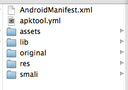
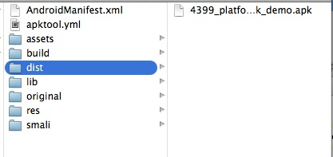
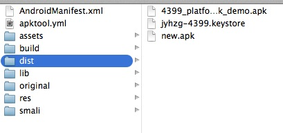
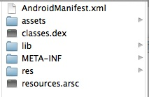

##Android学习笔记之反编译apk，熟悉apk各种构成
####From JiaYing.Cheng

---
---

1. 反编译apk
---
**APKTOOL的命令解释**

1.反编译APK命令

`decode`:该命令用于进行反编译apk文件，一般用法为 :

`apktool d <file.apk> <dir>`

`<file.apk>`代表了要反编译的apk文件的路径，最好写绝对路径，比如/Users/DaoCaoWu/Desktop/MusicPlayer.apk

`<dir>`代表了反编译后的文件的存储位置，比如`/Users/DaoCaoWu/Desktop/MusicPlayer

如果你给定的`<dir>`已经存在，那么输入完该命令后会提示你，并且无法执行，需要你重新修改命令加入-f指令

`apktool d –f <file.apk> <dir>`

这样就会强行覆盖已经存在的文件

2.编译修改好的文件

`build`:该命令用于编译修改好的文件，一般用法为:

`apktool b <dir>`

这里的`<dir>`就是刚才你反编译时输入的`<dir>`（如/Users/DaoCaoWu/Desktop/MusicPlayer）,输入这行命令后，如果一切正常，你会发现C:\MusicPlayer内多了2个文件夹build和dist，其中分别存储着编译过程中逐个编译的文件以及最终打包的apk文件。

3.install-framework

该命令用于为APKTool安装特定的framework-res.apk文件，以方便进行反编译一些与ROM相互依赖的APK文件。具体情况请看常见问题

**APKTOOL使用实例**

1.反编译剑与火之歌-4399Platform-Demo.APK

```
JiaYingChengdeiMac:~ DaoCaoWu$ cd Desktop/apktoolLibrary/
JiaYingChengdeiMac:apktoolLibrary DaoCaoWu$ apktool d /Users/DaoCaoWu/Desktop/apktoolLibrary/d /Users/DaoCaoWu/Desktop/apktoolLibrary/4399_platform_sdk_demo.apk 
I: Using Apktool 2.0.0-Beta7 on 4399_platform_sdk_demo.apk
I: Loading resource table...
I: Decoding AndroidManifest.xml with resources...
I: Loading resource table from file: /Users/DaoCaoWu/Library/apktool/framework/1.apk
I: Regular manifest package...
I: Decoding file-resources...
I: Decoding values */* XMLs...
I: Loading resource table...
I: Baksmaling...
I: Copying assets and libs...
I: Copying unknown files/dir...
I: Copying original files...
JiaYingChengdeiMac:apktoolLibrary DaoCaoWu$ 
```

反编译后的结果：



2.重新打包修改后的资源文件

```
JiaYingChengdeiMac:apktoolLibrary DaoCaoWu$ apktool b /Users/DaoCaoWu/Desktop/apktoolLibrary/4399_platform_sdk_demo 
I: Using Apktool 2.0.0-Beta7 on 4399_platform_sdk_demo
I: Checking whether sources has changed...
I: Smaling...
I: Checking whether resources has changed...
I: Building resources...
I: Copying libs...
I: Building apk file...
JiaYingChengdeiMac:apktoolLibrary DaoCaoWu$ 
```
重新打包成功后，在原文件夹下面会多出一个dist文件夹，重新打包的APK就存在下面



3.用命令行创建keystore
运行命令：

```
keytool -genkey -keystore jyhzg-4399.keystore -keyalg RSA -validity 10000 -alias jyhzg-4399.keystore
```
得到

```
JiaYingChengdeiMac:apktoolLibrary DaoCaoWu$ keytool -genkey -keystore jyhzg-4399.keystore -keyalg RSA -validity 10000 -alias jyhzg-4399.keystore
输入密钥库口令:  
再次输入新口令: 
您的名字与姓氏是什么?
  [Unknown]:  JiaYing.Cheng
您的组织单位名称是什么?
  [Unknown]:  Flamingo-inc
您的组织名称是什么?
  [Unknown]:  Flamingo-inc
您所在的城市或区域名称是什么?
  [Unknown]:  guangzhou
您所在的省/市/自治区名称是什么?
  [Unknown]:  guangdong    
该单位的双字母国家/地区代码是什么?
  [Unknown]:  cn
CN=JiaYing.Cheng, OU=Flamingo-inc, O=Flamingo-inc, L=guangzhou, ST=guangdong, C=cn是否正确?
  [否]:  y

输入 <jyhzg-4399.keystore> 的密钥口令
	(如果和密钥库口令相同, 按回车):  
JiaYingChengdeiMac:apktoolLibrary DaoCaoWu$ 
```

```
命令参数说明：
-genkey    产生证书文件 
-keystore  指定密钥库的.keystore文件中 

-keyalg     指定密钥的算法
-validity    为证书有效天数，这里我们写的是10000天。 
-alias       产生别名 
在输入密码时没有回显，只管输入就可以了，一般位数建议使用20位，切忌需要记下来后面还要用，
```


**注意：**

1. CN（Common Name – 名字与姓氏）：其实这个“名字与姓氏”应该是域名，比如说localhost或是blog.devep.net之类的。输成了姓名，和真正运行的时候域名不符，会出问题。浏览器访问时，弹出一个对话框，提示“安全证书上的名称无效，或者与站点名称不匹配”，用户选择继续还是可以浏览网页。但是用http client写程序访问的时候，会抛出类似于“javax.servlet.ServletException: HTTPS hostname wrong: should be ”的异常。
2. 在用keytool生成数字证书时必须保证：-keystore androidapp.keystore -alias androidapp.keystore 两者名称必须相同。否则下一步签名时会出现错误：jarsigner： 找不到 androidapp.keystore 的证书链。androidapp.keystore 必须引用包含专用密钥和相应的公共密钥证书链的有效密钥库密钥条目。


4.自动签名
将你准备签名的keystore放到当前目录下，运行命令：

```
JiaYingChengdeiMac:apktoolLibrary DaoCaoWu$jarsigner -verbose -keystore jyhzg-4399.keystore -signedjar new.apk 4399_platform_sdk_demo.apk jyhzg-4399.keystore
```
小解其意：

* 【keystore】:jyhzg-4399.keystore
* 【签名后的apk名字】:new.apk
* 【签名前的apk名字】:4399_platform_sdk_demo.apk

```
JiaYingChengdeiMac:dist DaoCaoWu$ jarsigner -verbose -keystore jyhzg-4399.keystore -signedjar new.apk 4399_platform_sdk_demo.apk jyhzg-4399.keystore
输入密钥库的密码短语: 
   正在添加: META-INF/MANIFEST.MF
   正在添加: META-INF/JYHZG-43.SF
   正在添加: META-INF/JYHZG-43.RSA
  正在签名: assets/alipay-newmsp-pro.apk
  正在签名: assets/base.zip
  正在签名: assets/game_bg.jpg
  正在签名: lib/armeabi/libentryex.so
  正在签名: lib/armeabi/libgame.so
  正在签名: res/drawable/data.bin
  正在签名: res/drawable/ic_launcher.png
  正在签名: res/layout/main.xml
  正在签名: AndroidManifest.xml
  正在签名: classes.dex
  正在签名: resources.arsc
jar signed.

警告: 
No -tsa or -tsacert is provided and this jar is not timestamped. Without a timestamp, users may not be able to validate this jar after the signer certificate's expiration date (2042-02-09) or after any future revocation date.
JiaYingChengdeiMac:dist DaoCaoWu$ 
```



---

2. 熟悉apk各种构成
---
看一下游戏开发完成后打包的apk的解压图：




- AndroidManifest.xml #经过压缩的Android应用配置文件，描述了					应用的名字、版本、权限、引用的库文件等等信息
- assets #可以存放一些配置文件，以及游戏资源
- classes.dex #是java源码编译后生成的java字节码文件
- lib
	- armeabi #动态链接库（.so）
- META-INF #存储的是关于签名的一些信息
- res #存放资源文件。包括图片，字符串等等
- resources.arsc #编译后的二进制资源文件