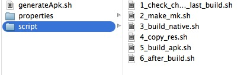

##Android学习笔记之阅读打包脚本，熟悉打包流程之Shell、Gradle
####From JiaYing.Cheng

---
---

###Shell



`generateApk.sh` 一键打包APK入口脚本

1. `1_check_changes_from_last_build.sh`查找当前版本与上一个编译版本源文件存在差异的地方
2. `2_make_mk.sh`自动生成mk(libcocos2dlua模块)
3. `3_build_native.sh`使用NDK编译脚本
4. `4_copy_res.sh`压缩并移动文件
5. `5_build_apk.sh`生成APK文件并移动到指定路径
6. `6_after_build.sh`APK安装到设备、上传apk及带符号的so到ftp

###Gradle的配置脚本build.gradle

```
apply plugin: 'android'

android {
    compileSdkVersion 18
    buildToolsVersion '19.1.0'

    defaultConfig {
        minSdkVersion 9
        targetSdkVersion 9
        versionCode 1003
        versionName "1.0.0.3"
    }
    signingConfigs {
        debugSign {
            storeFile file("sign/debug/lqsj_sign.keystore")
            storePassword "123456"
            keyAlias "lqsj"
            keyPassword "123456"
        }
    }
    buildTypes {
        debug {
            jniDebugBuild true
            debuggable true
            signingConfig signingConfigs.debugSign
            zipAlign true
        }
        release {
            jniDebugBuild false
            debuggable false
            runProguard false
            proguardFiles getDefaultProguardFile('proguard-android.txt'), 'proguard-rules.txt'
            zipAlign false
        }
    }
    productFlavors {
        origin {
            packageName = 'com.flamingo.dragon.origin'
        }
        testRealms {
            packageName = 'com.flamingo.dragon.testrealms'
        }
        xxzs {
            packageName = 'com.flamingo.dragon.xxzs'
        }
        sy4399 {
            packageName = 'com.flamingo.dragon.sy4399'
            versionCode 1003
            versionName "1.0.0.3"
        }
    }
    sourceSets {
        main {
            jniLibs.srcDir 'src/../libs'
        }
        origin {

        }
        testRealms {

        }
        xxzs {

        }
        sy4399 {

        }
    }
}

dependencies {
    compile fileTree(dir: 'libs', include: ['*.jar'])
    compile project(path: ':FLPlatformLibrary')
    sy4399Compile fileTree(dir: 'third_party/sy4399', include: ['*.jar'])
}
```

**buildscript{}**
`Configures the build script classpath for this project. `  

就是设置脚本的运行环境

**repositories{}**

`Returns a handler to create repositories which are used for retrieving dependencies and uploading artifacts produced by the project. `  

大意就是支持java 依赖库管理（maven/ivy）,用于项目的依赖。这也是gradle 强力的地方。

**dependencies{}**

`The dependency handler of this project. The returned dependency handler instance can be used for adding new dependencies. For accessing already declared dependencies, the configurations can be used. `
  
依赖包的定义。支持maven/ivy，远程，本地库，也支持单文件，如果前面定义了repositories{}maven 库，使用maven的依赖（我没接触过ivy。。）的时候只需要按照用类似于com.android.tools.build:gradle:0.4，gradle 就会自动的往远程库下载相应的依赖。

**apply plugin:**

声明构建的项目类型，这里当然是android了。

**android{}**

设置编译android项目的参数，接下来，我们的构建android项目的所有配置都在这里完成。

___
使用gradle build 就完成了android 项目的构建了。你将会想项目目录里面看到一个build 的目录，里面就是用gradle 构建android项目的全部内容了。

最终打包的apk 就在build/apk 目录下了。然后，你会发现，两个apk 一个是 [项目名]-debug-unaligned [项目名]-release-unsigned


---

###Gralde 打包参数详解
上面说了一大堆东西，其实并不吸引人去使用gradle，如果只是构建项目的话，adt不是更合适吗？请看下面的分析。

**打签名包**

默认输出`release apk`是没有签名的，那么我们需要签名的很简单，只需要在android{}里面补充加上加上即可。[完整build.gradle请参考这个链接](https://gist.github.com/youxiachai/5608223)。

build.gradle

```
android {
    ...
    signingConfigs {
        debugSign {
            storeFile file("sign/debug/lqsj_sign.keystore")
            storePassword "123456"
            keyAlias "lqsj"
            keyPassword "123456"
        }
    }
    buildTypes {
        debug {
            jniDebugBuild true
            debuggable true
            signingConfig signingConfigs.debugSign
            zipAlign true
        }
        release {
            jniDebugBuild false
            debuggable false
            runProguard false
            proguardFiles getDefaultProguardFile('proguard-android.txt'), 'proguard-rules.txt'
            zipAlign false
        }
    }
    ...
}
```

然后，运行`gradle clean` `gradle build` ,这时在build/apk 你看到了多了一个[项目名]-release-unaligned， 从字面上面我就可以知道，这个只是没有进行`zipAlign`优化的版本而已。而[项目名]-release 就是我们**签名`lqsj_sign.keystore`**，并且`zipAlign`的apk包了.

***打混淆包*** 只需要在原来的基础上加上，

```
buildTypes{
   release {
   signingConfig  signingConfigs.myConfig
     runProguard true
     proguardFile 'proguard-android.txt'
   }
}
```

`gradle clean`

`gradle build`

---

###打多渠道包(Product Flavor)

上面说到了apk目录下的两个apk

为什么产生了两个apk？

默认的android gralde 插件定义了两种apk 的类型debug, release，这两种类型的详细对比看附录。

这个是android gralde 插件 `buildTypes{}` 方法产生的，默认配置好了两个默认模板，当然你也可以修改，前面我们就是在修改默认的release 的配置，让输出release类型的的apk，具有`签名`和`混淆`。

对于`多渠道包`，android 插件提供了一个名为`Product Flavor{}` 的配置，用于进行**多渠道打包**。

例如，我的android应用有海外版，和国内版本，而且这两个版本的包名是不一样的！要打包100个不同的市场只是几行代码的事情。

你只需要在`android{}` 补充上

build.gradle

```
productFlavors {
        origin {
            packageName = 'com.flamingo.dragon.origin'
        }
        testRealms {
            packageName = 'com.flamingo.dragon.testrealms'
        }
        xxzs {
            packageName = 'com.flamingo.dragon.xxzs'
        }
        sy4399 {
            packageName = 'com.flamingo.dragon.sy4399'
            versionCode 1003
            versionName "1.0.0.3"
        }
}
```

然后`gradle clean`,`gradle build`,在build/apk 下面你会看到一堆的包，命名格式`[项目名]-[渠道名]-release`

***仅此而已?***

`Product Flavor{}` 不只是能改包名那么简单，还能够**对编译的源码目录进行切换**。

如果，你有很多渠道，以前会很痛苦，现在用gradle 就非常舒服，你只需要在android.sourceSets指定我们的渠道名就行，android gradle 插件，会自动打包！例如

build.gradle

```
sourceSets {
    main {
        manifest.srcFile 'AndroidManifest.xml'
        java.srcDirs = ['src']
        resources.srcDirs = ['src']
        aidl.srcDirs = ['src']
        renderscript.srcDirs = ['src']
        res.srcDirs = ['res']
        assets.srcDirs = ['assets']
    }
    hiapk {
      	manifest.srcFile 'hiapk/AndroidManifest.xml'
    }    	
    playstore {
       	manifest.srcFile 'hiapk/AndroidManifest.xml'
    }
    origin {}
    testRealms {}
    xxzs {}
    sy4399 {}
    instrumentTest.setRoot('tests')
}
```


 ***外部依赖***
android gradle 对于外部jar 包的应用支持maven/ivy 管理的包，也支持指定具体文件。你需要加上如下代码即可:
build.gradle

```
dependencies {
    compile fileTree(dir: 'libs', include: ['*.jar'])
    compile project(path: ':FLPlatformLibrary')
    sy4399Compile fileTree(dir: 'third_party/sy4399', include: ['*.jar'])
}
```

---

***一个德国人写的[Android-Gradle-Examples](https://github.com/Goddchen/Android-Gradle-Examples)***

---